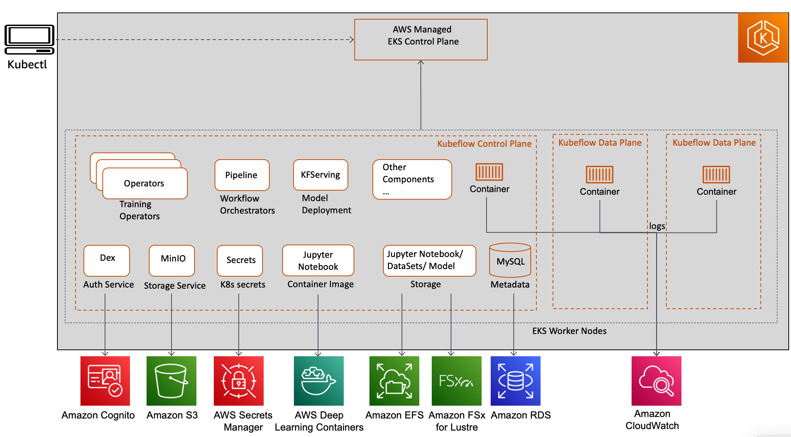
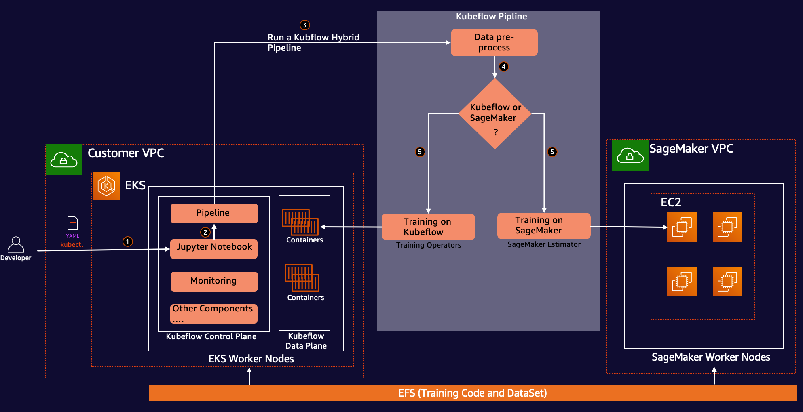

# Workshop: Distributed Model Training on Kubernetes with Kubeflow on AWS and Amazon SageMaker

## 1. Introduction 

In this workshop, we demonstrate how Kubeflow on AWS integration with AWS Deep Learning Containers, Amazon SageMaker and Amazon Elastic File System (Amazon EFS) increases the efficiency of building, training, and deploying deep learning models in terms of flexibility and time using both EKS and Amazon SageMaker in a hybrid architecture. 

Machine learning development relies on complex and continuously evolving open source frameworks and toolkits, as well as complex and continuously evolving hardware ecosystems. This poses a challenge when scaling up machine learning development to a cluster. Containers offer a solution, since they can fully encapsulate not just the training code, but the entire dependency stack down to the hardware libraries, ensuring a machine learning environment that is consistent and portable. and facilitating reproducibility of the training environment on each individual node. Kubernetes is a widely adopted system for automating deployment, scaling, and management of containerized applications.

Kubeflow aims to make the deployment of machine learning end-to-end workflows on Kubernetes simple, portable and scalable. Customers are leveraging Kubeflow to deploy best-of-breed open-source systems for machine learning to diverse infrastructures.  This tutorial will demonstrate how to leverage Kubeflow to implement a machine learning pipeline  for distributed training based on either a self-managed approach, or leveraging the SageMaker platform.  At the end, we will demonstrate the implementation of a hybrid reference architecture that allows for customers to choose between both approaches at run-time, conferring maximum control and flexibility  to customers with stringent needs for their deployments.

## 2. Kubeflow on AWS

Kubeflow on AWS (https://awslabs.github.io/kubeflow-manifests/) (an AWS-specific distribution of Kubeflow) adds value over open-source Kubeflow through the integration of highly optimized, cloud-native, enterprise-ready AWS services.

AWS distribution of kubeflow provide enterprise grade semi-managed kubeflow service. With AWS distro customer can replace kubeflow control plane services like database, storage, monitoring, user management to AWS managed services like RDS, S3/EFS/FSx, CloudWatch and Cognito. By replacing these kubeflow services gets decoupled with EKS cluster and kubeflow deployment becomes stateless. It also free up the storage and compute from EKS data plane which might be needed for applications such as training or users notebook. We also recommend kubeflow users to use (Deep learning containers) DLC (https://aws.amazon.com/machine-learning/containers/) images which are pre-packaged and preconfigured with AWS optimized deep learning frameworks such as PyTorch and Tensorflow. AWS Kubeflow distribution notebook images has these framework and customer can use them for their training purpose as well. 

## 3. Kubeflow on AWS Architecture 

  

## 4. Hybrid Architecture on EKS with Kubeflow and SageMaker

  

## 5. Workshop Steps

Please refer [WORKSHOP_STEPS](WORKSHOP_STEPS.md#workshop-steps) for workshop execution steps.

