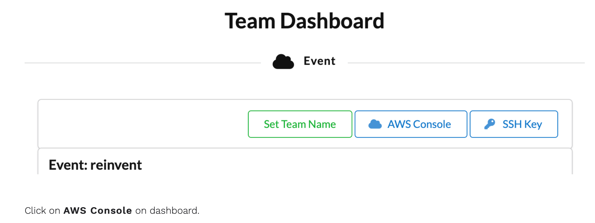
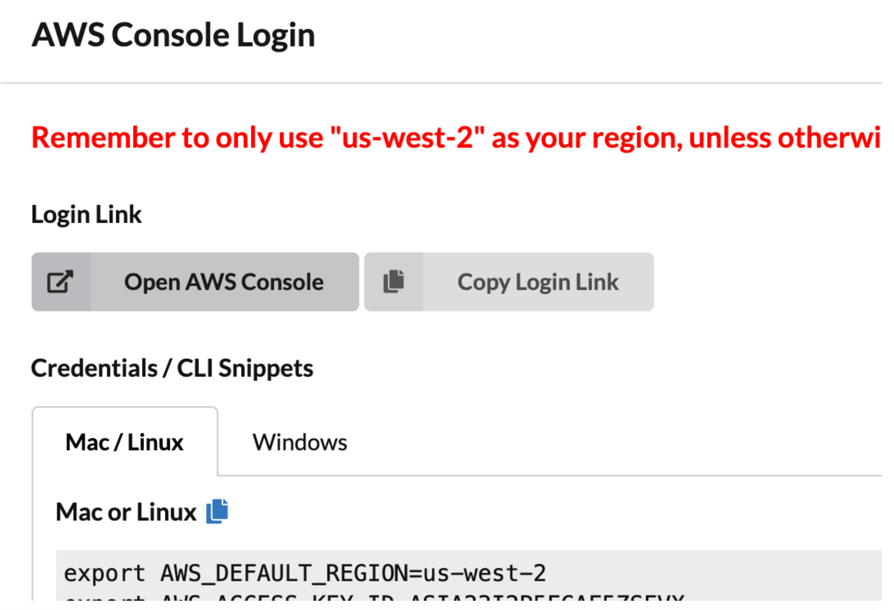
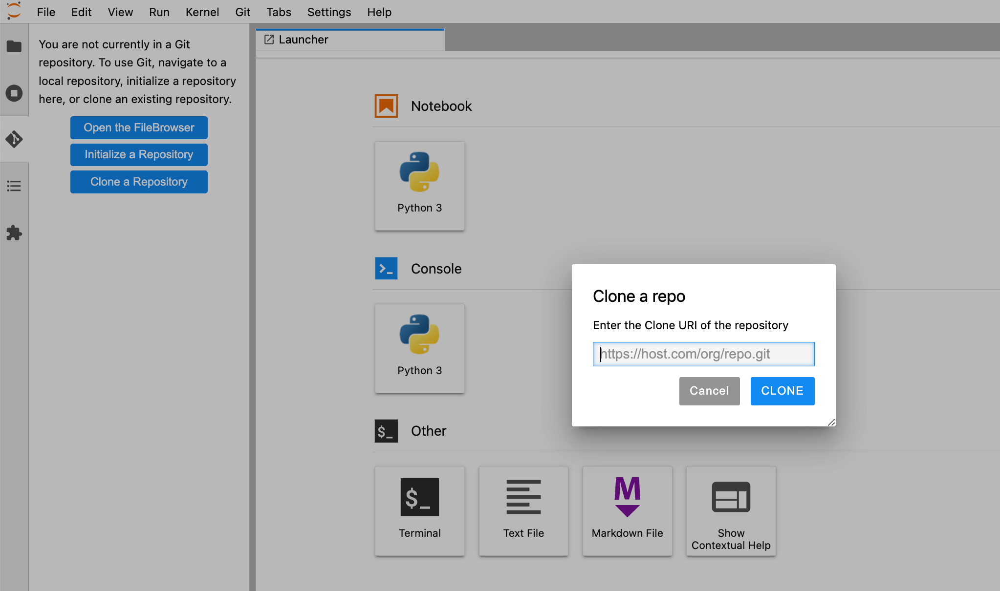

# Workshop Execution Steps

## 1. Set up AWS Accounts

a. If you are running the workshop on your own and you don’t already have an AWS account with Administrator access, please create one now by clicking here (https://aws.amazon.com/getting-started/)

b. If you are running the workshop at an AWS Event or with AWS teams, Login to AWS Workshop Portal by clicking the button or browsing to https://dashboard.eventengine.run/

The following screen shows up.


<center> </center> <br/><br/>


Enter the provided hash (will be provided in the chat by the event administrator) in the text box. The button on the bottom right corner activates to Accept Terms & Login. Click on that button to continue.


<center> </center><br/><br/>


<center> </center><br/><br/>


Take the defaults and click on Open AWS Console. This will open AWS Console in a new browser tab.

## 3. Register Cloud9 Environment

If you are using a temporary AWS account provisioned by Event Engine and provided to you for the workshop, an EKS cluster and an EC2 instance that has access to the cluster and has Cloud9 installed is already created for you. This section will describe  how to register your existing instance as a Cloud9 environment. 
If you are using your own account, you can create a Cloud9 environment and and EKS cluster, following steps 0 and 1 from [this workshop](https://github.com/aws-samples/aws-distributed-training-workshop-eks).

To register the Cloud9 Environment from your existing EC2 instance with the AWS console, navigate to [Cloud9](https://us-west-2.console.aws.amazon.com/cloud9/home?region=us-west-2), then click the “Create environment” button.


<center> </center><br/><br/>


Enter a name for your environment and click “Next step”


<center> </center><br/><br/>


In a new window, open the [EC2 Console](https://us-west-2.console.aws.amazon.com/ec2/v2/home?region=us-west-2#Instances:instanceState=running) and list your running instances.
Then select the m5.xlarge instance that is not an EKS node and copy its Public IPv4 address.


<center> </center> <br/><br/>


Click the “Connect” button in the upper right section of the screen and then click the “Connect” button on the Session Manager tab


<center> </center><br/><br/>


The Session Manager will open a shell window in your browser, connected to the EC2 instance. Execute:

```
sudo su ec2-user
cd ~/.ssh
vi authorized_keys
```

Switch back to the Cloud9 screen, type ec2-user in the User field and paste the public IP address of your EC2 instance in the Host field, then click the Copy key to clipboard button.


<center> </center><br/><br/>

Open the Session Manager window and paste the copied public key into the authorized_keys file and save 

<center> </center> <br/><br/>


Then click “Next step” in the Cloud9 console and “Create environment” on the Review screen.


<center> <br/>

The browser will open the newly created Cloud9 environment. We will use this environment for the remainder of the workshop. You may close the Session Manager window. 

<center> </center><br/><br/>


## 4. Deploy Kubeflow

From your Cloud9 environment, clone the aws-do-kubeflow repository:

```
git clone https://github.com/aws-samples/aws-do-kubeflow
cd aws-do-kubeflow
```

Get names of available EKS clusters

```
eksctl get clusters

NAME            REGION          EKSCTL CREATED
eks-kubeflow    us-west-2       True
```

Configure the project
```
./config.sh
```

Modify the cluster name setting to match the name of the available EKS cluster in your environment
`export AWS_CLUSTER_NAME=eks-kubeflow`

Ensure the Kubeflow distribution is set to "aws"
`export KF_DISTRO=aws`

and save the configuration.

Then build and run the aws-do-kubeflow Docker container:

```
./build.sh
./run.sh
```

Open a new Terminal in your Cloud9 environment and position it side by side with your current terminal, execute a watch command to continuously display all of the running pods in the cluster:

watch kubectl get pods -A

In the original terminal, open a shell into the running aws-do-kubeflow container and execute the kubeflow deploy script.

```
./exec.sh
./kubeflow-deploy.sh
```

As Kubeflow is deployed to the cluster, you will see new pods in your watch window. When all pods enter the Running state, your Kubeflow instance is fully deployed.


<center> </center><br/>


## 5. Login to Kubeflow Dashboard

To securely connect to the Kubeflow dashboard, from within the aws-do-kubeflow container execute:
```
./kubeflow-expose.sh
```
Then select Preview→Preview Running Application from the Cloud9 menu


<center> </center><br/><br/>


This will display your the Kubeflow login screen inside a tab within the Cloud9 environment. Click the detach icon located next to the“Browser” button in the right corner of the tab to open the Kubeflow dashboard in a separate browser window.


<center></center><br/><br/>


Enter the default credentials (user@example.com / 12341234) to log in to your Kubeflow instance.

Once you are logged into the Kubeflow dashboard, ensure you have the right namespace “kubeflow-user-example-com” on top of the drop down 


<center> </center><br/><br/>


## 6. Create EFS volume


Click on Volumes on the left navigation. Click on New Volume in Volumes UI screen and enter following:
    1. Name:  “efs-sc-claim”, 
    2. Volume size: 10 Gi, 
    3. storage class: “efs-sc”  
    4. Access mode: ReadWriteonce


<center> </center><br/><br/>


Verify volume efs-sc-claim is created 


<center> </center><br/><br/>


## 7. Create Jupyter Notebook 

Click on “Notebooks” on left navigation of the Kubeflow dashboard. Click on “NEW NOTEBOOK” button. Enter name as “aws-hybrid-nb”, select “pytoch:1.9.0-cpu-py38” as Jupyter Docket Image. Enter 1 for CPU and memory fields. 


<center> </center><br/><br/>


Add Data Volumes as shown below. Make sure Name is entered as “efs-sc-claim”


<center> </center><br/><br/>


Verify if notebook is created successfully and CONNECT button is activated.


<center> <center/><br/><br/>


Click on CONNECT button to log on to JupyterLab like below. 


<center> </center><br/><br/>


Clone the repo “aws-sample”


<center> </center><br/><br/>


## 8. Run notebook “1_submit_pytorchdist_k8s.ipynb”       

## 9. Run notebook “2_create_pipeline_k8s_sagemaker.ipynb”    

Click on “Run details” link in the following cell. 


<center> </center><br/><br/>


You will see the pipeline run executed . 

<center> </center><br/><br/>

