# Workshop Execution Steps

## 1. Set up AWS Accounts

1.1 If you are running the workshop **on your own** and you don’t already have an AWS account with Administrator access, please create one now by clicking here (https://aws.amazon.com/getting-started/). This workshop assumes that you already have an EKS cluster. If not, we recommend that you refer to the [aws-do-eks](https://github.com/aws-samples/aws-do-eks) project and create one using the [eks-kubeflow.yaml](https://github.com/aws-samples/aws-do-eks/blob/main/wd/conf/eksctl/yaml/eks-kubeflow.yaml) cluster manifest. An easy way to do that is to use this [CloudFormation template](https://raw.githubusercontent.com/aws-samples/aws-do-eks/main/wd/cfn/dtw-kubeflow/ManagementInstance.json) which creates an EC2 Management Instance and uses it to provision the `eks-kubeflow` cluster in the `us-west-2` region. When you save the [template](https://raw.githubusercontent.com/aws-samples/aws-do-eks/main/wd/cfn/dtw-kubeflow/ManagementInstance.json) locally you can either create the stack from the [CloudFormation Console](https://us-west-2.console.aws.amazon.com/cloudformation/home?region=us-west-2#/stacks/create) or by executing the following command:

```bash
aws cloudformation create-stack --stack-name ManagementInstance --template-body file://ManagementInstance.json --capabilities CAPABILITY_IAM
```

Please note that the setup process could take about 30 minutes to complete. Progress can be observed in the stack creation events in the [Cloud9 console](https://us-west-2.console.aws.amazon.com/cloudformation/home?region=us-west-2#/stacks). Once the Management Instance stack is created, the actual instance can be identified in the Resources tab. Navigate to the EC2 instance and connect to it using `Session Manager`.
 
Logs from the setup process are written to file `/tmp/bootstrap.log` on the Management Instance. The setup process is complete when "Done executing userdata script." is written to the end of this log file.

Execute the following, to verify that the setup process was successful and you are able to access the EKS cluster:

```
sudo su ec2-user
kubectl get nodes
```

If the above command returns a list of nodes, then you may proceed to [step 2](https://github.com/aws-samples/aws-do-kubeflow/blob/main/Container-Root/kubeflow/examples/distributed-training/pytorch/workshop/WORKSHOP_STEPS.md#2-register-cloud9-environment). Otherwise, please double-check the `bootstrap.log` and CloudFormation stacks for any errors. Refer to the [Troubleshooting](https://github.com/aws-samples/aws-do-kubeflow/blob/main/Container-Root/kubeflow/examples/distributed-training/pytorch/workshop/WORKSHOP_STEPS.md#troubleshooting) section as needed.


1.2 If you are running the workshop **at an AWS Event or with AWS teams**, Login to AWS Workshop Portal by clicking the button or browsing to https://dashboard.eventengine.run/

The following screen shows up.

<center> </center> <br/><br/>

1.3 Enter the provided hash (will be provided in the chat by the event administrator) in the text box. The button on the bottom right corner activates to Accept Terms & Login. Click on that button to continue the next screen below.


<center> </center><br/><br/>


1.4 Click on "Email One-Time Password(OTP)" and enter your email and click on "Send passcode" as below. 


<center> </center> <br/><br/>


1.5 Enter the 9 digit passcode that you recieve in your email and click "Sign in"


<center> </center> <br/><br/>


1.6 Click on "AWS Console" button 

<center> </center> <br/><br/>


1.7 Take the defaults and click on "Open Console". This will open AWS Console in a new browser tab.

<center> </center> <br/><br/>


## 2. Register Cloud9 Environment

2.1 If you are using **your own account**, you can create a Cloud9 environment and EKS cluster, following steps 0 and 1 from [this workshop](https://github.com/aws-samples/aws-distributed-training-workshop-eks).

2.2 If you are running the workshop **at an AWS Event or with AWS teams**, an EKS cluster and an EC2 instance that has access to the cluster and has Cloud9 installed is already created for you. This section will describe  how to register your existing instance as a Cloud9 environment. 

2.3 To register the Cloud9 Environment from your existing EC2 instance with the AWS console, navigate to [Cloud9](https://us-west-2.console.aws.amazon.com/cloud9/home?region=us-west-2), then click the “Create environment” button.


<center>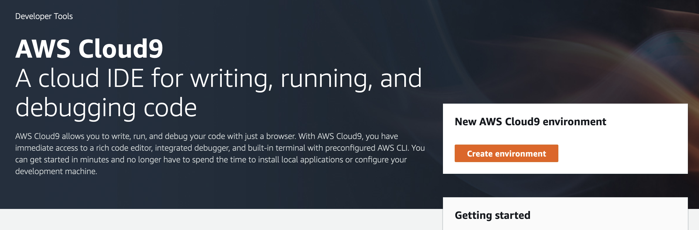 </center><br/><br/>


2.4 Enter a name for your environment and click “Next step”


<center>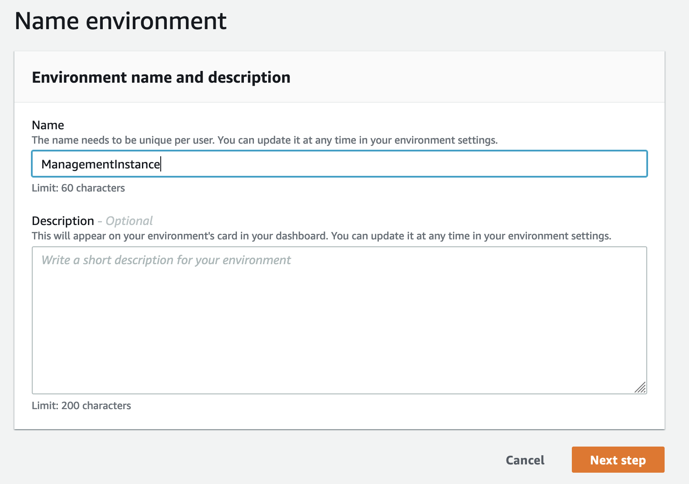 </center><br/><br/>


2.5 In a new window, open the [EC2 Console](https://us-west-2.console.aws.amazon.com/ec2/v2/home?region=us-west-2#Instances:instanceState=running) and list your running instances.

2.6 Select the m5.xlarge instance that is not an EKS node and ***copy its Public IPv4 address***.


<center>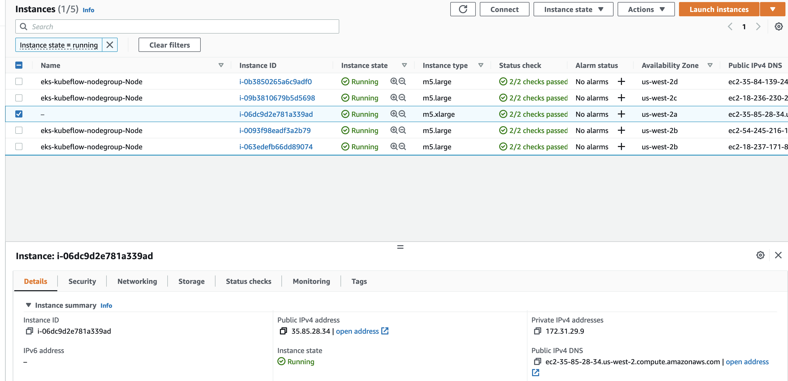 </center> <br/><br/>


2.7 Click the “Connect” button in the upper right section of the screen and then click the “Connect” button on the Session Manager tab


<center>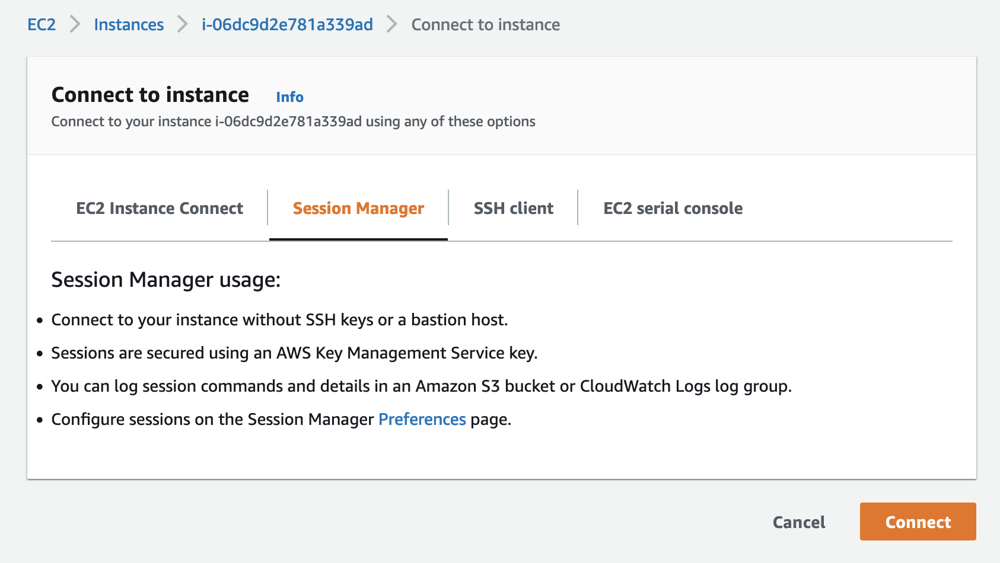 </center><br/><br/>


2.8 The Session Manager will open a shell window in your browser, connected to the EC2 instance. Execute:

```
sudo su ec2-user
cd ~/.ssh
vi authorized_keys
```

2.9 Switch back to the Cloud9 screen, type ec2-user in the User field and paste the public IP address of your EC2 instance in the Host field, then click the Copy key to clipboard button.


<center>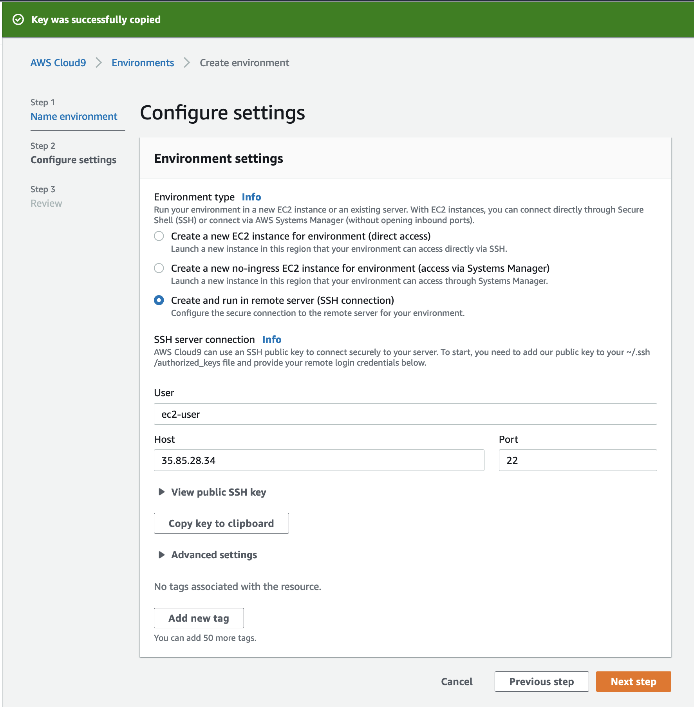 </center><br/><br/>

2.10 Open the Session Manager window and paste the copied public key into the authorized_keys file and save 

<center>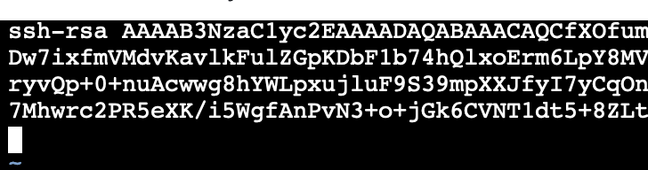 </center> <br/><br/>

To save authorized_keys file, Press Esc to enter Command mode, and then type :wq to write and then hit enter to quit the file.


2.11 Then click “Next step” in the Cloud9 console and “Create environment” on the Review screen.


<center>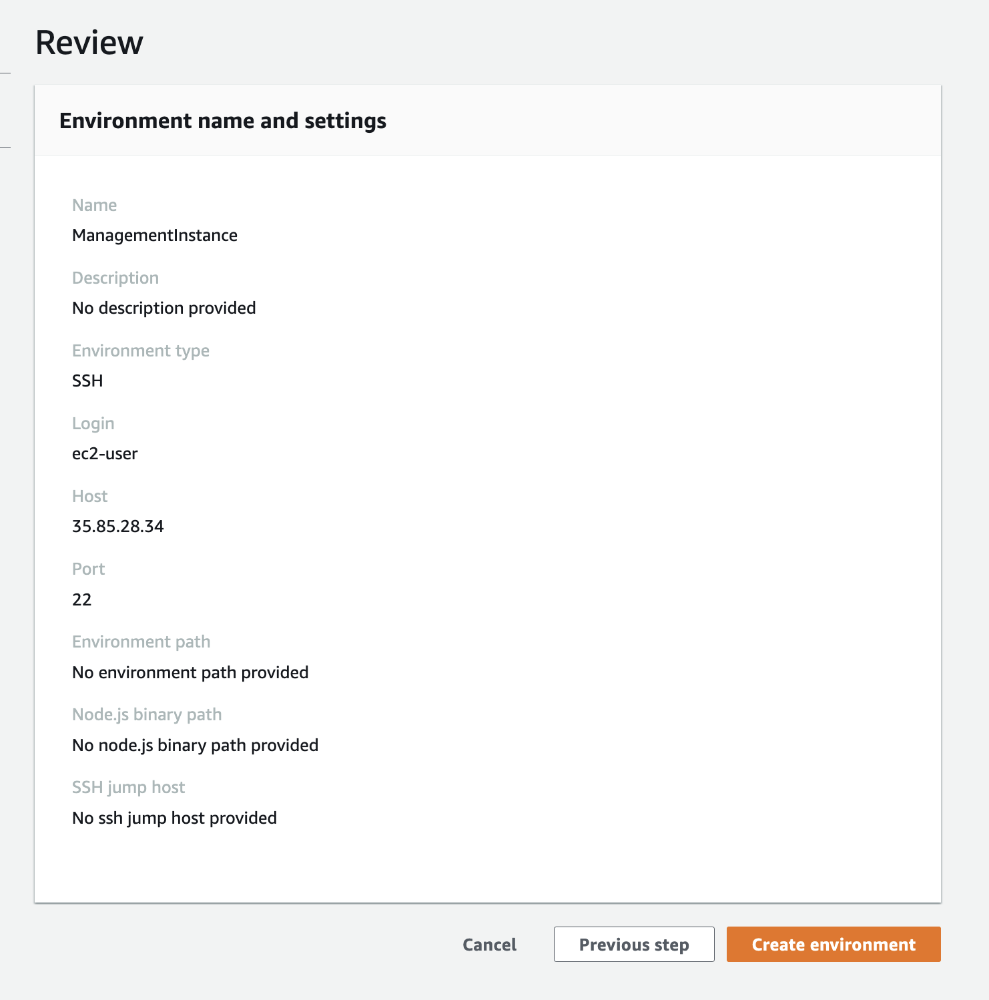 </center><br/>

2.12 The browser will open the newly created Cloud9 environment. We will use this environment for the remainder of the workshop. You may close the Session Manager window. 

<center>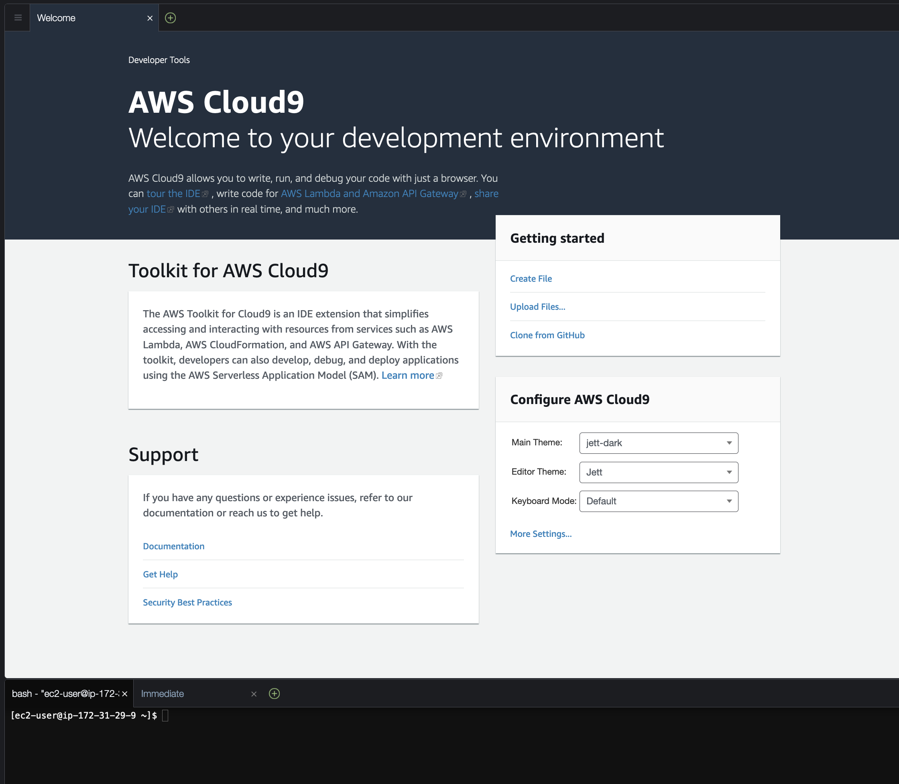 </center><br/><br/>

2.13 Ensure AWS managed temporary credentials in Cloud9 are disabled

If you are using your own Cloud9 environment, it comes with AWS manged temporary credentials enabled by default. These credentials may override other credentials that you set in the environment and therefore we will make sure to disable them.

Click on the settings icon in the upper right corner of the Cloud9 IDE, or click on the Cloud9 icon in the menu and select Preferences. Scroll the list of preferences down and select the `AWS Settings` section. Make sure the `AWS managed temporary credentials` settings is diabled as shown below.

<center> </center><br/><br/>

If this setting is not available in your `AWS Settings` menu, then your Cloud9 environment did not come with managed temporary credentials enabled and you do not have to disable them.

## 3. Deploy Kubeflow

3.1 From your Cloud9 environment, click on "+" icon and open new terminal. Clone the aws-do-kubeflow repository:

```
git clone https://github.com/aws-samples/aws-do-kubeflow
cd aws-do-kubeflow
```

3.2 Get names of available EKS clusters

```
eksctl get clusters

NAME            REGION          EKSCTL CREATED
eks-kubeflow    us-west-2       True
```

3.3 **This is an optional step and has been initialized for the AWS Workshop** and is just to see/update the configurations if you building it in your own projects: Configure the project
```
./config.sh
```

Optional: Modify the cluster name setting in the file to match the name of the available EKS cluster in your environment
`export AWS_CLUSTER_NAME=eks-kubeflow`

Optional: Ensure the Kubeflow distribution is set to "aws"
`export KF_DISTRO=aws`

Optional: and save the configuration.

3.4 Then build and run the aws-do-kubeflow Docker container:

```
./build.sh
./run.sh
```

3.5 Open a new Terminal in your Cloud9 environment and optionally position it side by side with your current terminal, execute a watch command to continuously display all of the running pods in the cluster:

watch kubectl get pods -A

3.6 In the original terminal once step 3.4 completes and you see cli prompt $, open a shell into the running aws-do-kubeflow container and execute the kubeflow deploy scripts. 
 
```
./exec.sh
```

3.7 Execute the below script once step 3.6 completes

```
./kubeflow-deploy.sh
```

3.8 As Kubeflow is deployed to the cluster, you will see new pods in your watch window. When all pods enter the Running state, your Kubeflow instance is fully deployed.


<center>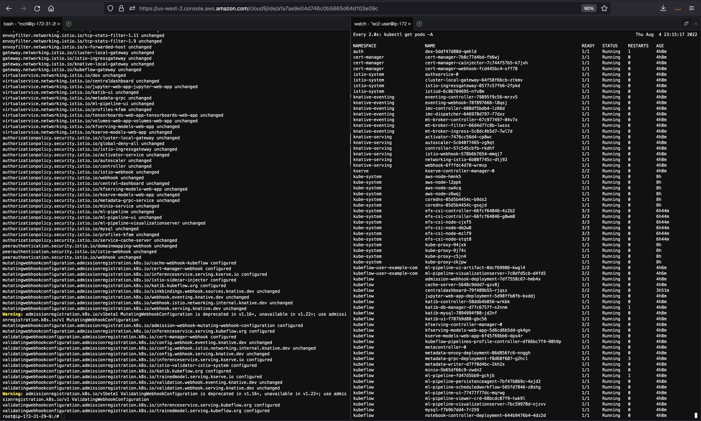 </center><br/>


## 4. Login to Kubeflow Dashboard

4.1 To securely connect to the Kubeflow dashboard, from within the aws-do-kubeflow container execute(the original terminal same as in step 3.6):

```
./kubeflow-expose.sh
```

4.2 Then select Preview→Preview Running Application from the Cloud9 menu


<center>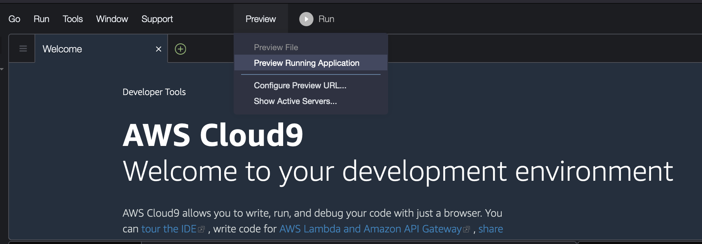 </center><br/><br/>


4.3 This will display the Kubeflow login screen inside a tab within the Cloud9 environment. Click the detach icon located next to the “Browser” button in the right corner of the tab to open the Kubeflow dashboard in a separate browser tab.


<center>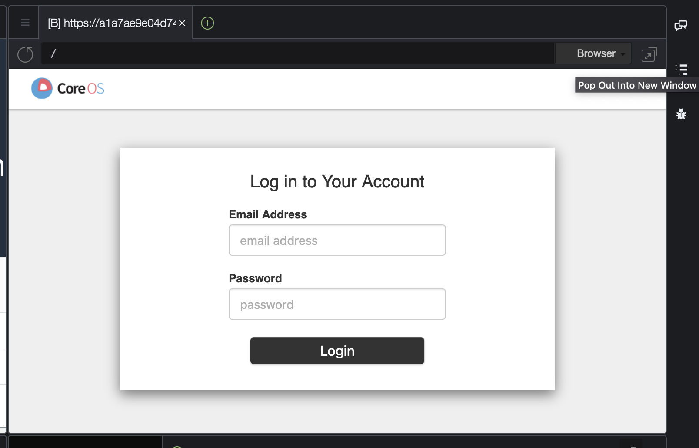</center><br/><br/>

If the Kubeflow dashboard fails to open in a separate browser tab, go to the troubleshooting section at the end of this page.

4.4 Enter the default credentials (user@example.com / 12341234) to log in to your Kubeflow instance.

4.5 Once you are logged into the Kubeflow dashboard, ensure you have the right namespace "kubeflow-user-example-com" on top of the drop down 


<center> </center><br/><br/>

> **_NOTE:_** If you do not see the namespace "kubeflow-user-example-com" selected in your Kubeflow dashboard, or you experience any other errors, please execute script `./kubeflow-restart.sh`, located in the aws-do-kubeflow container.

## 5. Create EFS volume


5.1 Click on Volumes on the left navigation. Click on New Volume in Volumes UI screen and enter following:
    1. Name:  “efs-sc-claim”, 
    2. Volume size: 10 Gi, 
    3. storage class: “efs-sc”  
    4. Access mode: ReadWriteOnce


<center>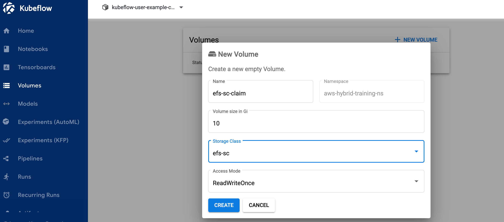 </center><br/><br/>


5.2 Verify volume efs-sc-claim is created 


<center>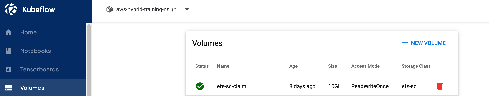 </center><br/><br/>


## 6. Create Jupyter Notebook 

6.1 Click on “Notebooks” on left navigation of the Kubeflow dashboard. Click on “New Notebook” button. Enter name as “aws-hybrid-nb”, select “jupyter-pytorch:1.11.0-cpu-py38” as Jupyter Docket Image. Enter 1 for CPU and 5 as memory in Gi. Keep GPUs as None.


<center>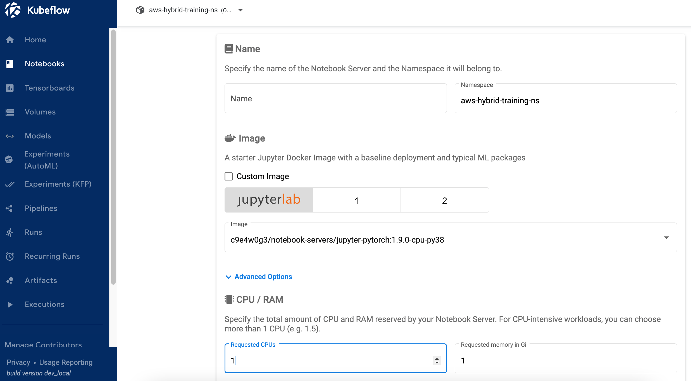 </center><br/><br/>


6.2 Do not change "Workspace Volume" section. 

6.3 Click "Attach existing volume" in Data Volumes section. Expand Existing volume secion. Select Name as "efs-sc-claim" and enter "/home/jovyan/efs-sc-claim" as Mount path. 

<center>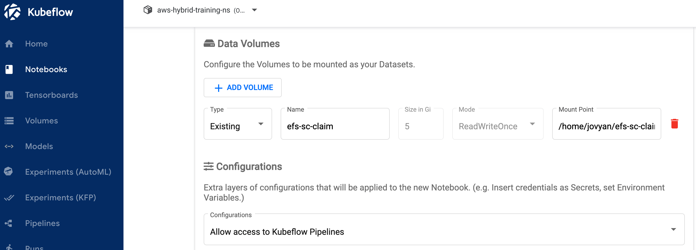 </center><br/><br/>

6.4 Select value "Allow access to Kubeflow Pipelines" in Configurations section and click LAUNCH . 

<center>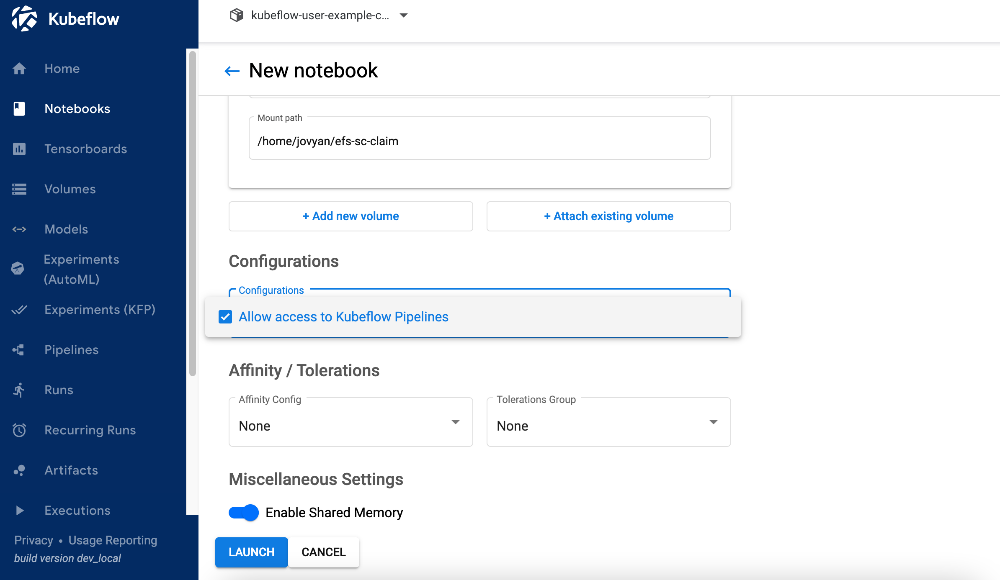 </center><br/><br/>


6.5 Verify if notebook is created successfully and CONNECT button is activated. It might takes couple of minutes to create a notebook. 


<center>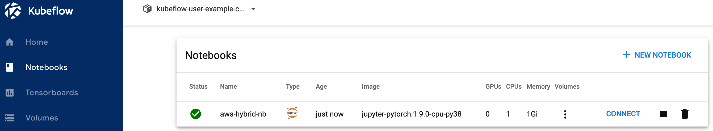 </center><br/><br/>


6.6 Click on CONNECT button to log on to JupyterLab like below. 


<center>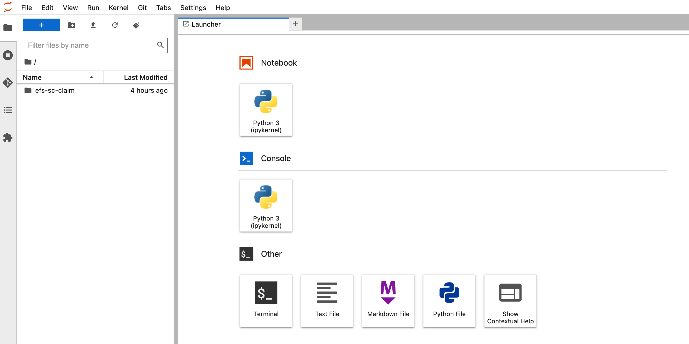 </center><br/><br/>


6.7 Clone the repo by entering `https://github.com/aws-samples/aws-do-kubeflow` in "Clone a repo" field

<center>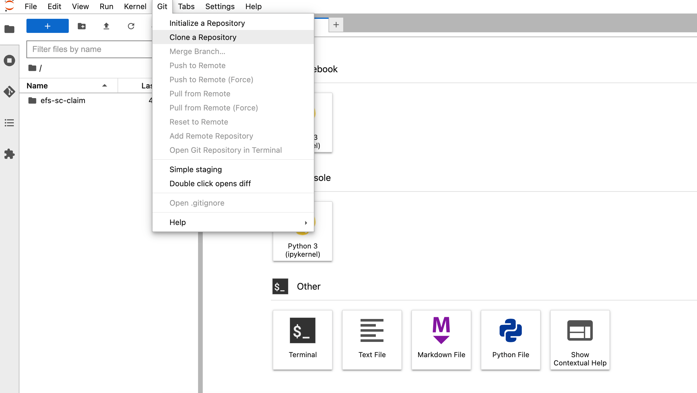 </center><br/><br/>


<center>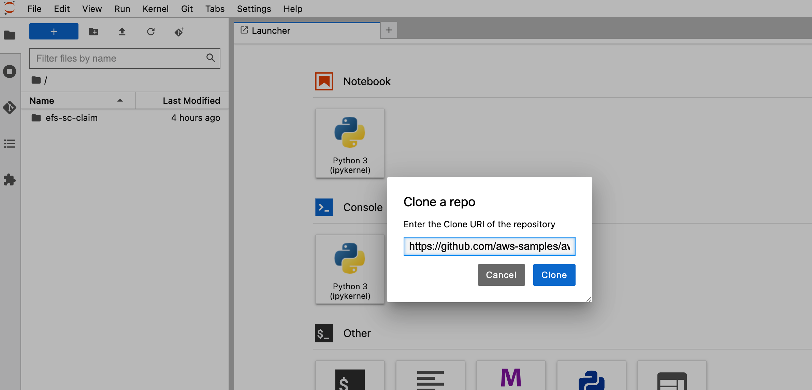 </center><br/><br/>

6.8 Browse to "aws-do-kubeflow/Container-Root/kubeflow/examples/distributed-training/pytorch/workshop" folder

6.9 Run notebook "0_initialize_dependencies.ipynb". Please wait for it to finish execution before you move on to next step

6.10 Run notebook “1_submit_pytorchdist_k8s.ipynb”      

Please ensure notebook '0_initialize_dependencies.ipynb' has finished executing the install scripts before you start with this notebook.

6.11 Run notebook “2_create_pipeline_k8s_sagemaker.ipynb”    

Please ensure you have executed notebook '1_submit_pytorchdist_k8s.ipynb' before you start with this notebook

If you get sagemaker import error then please do 
     1. !pip install sagemaker
     2. restart the Kernel (Go to 'Kernel' Menu -> Click 'Restart Kernel...')

6.12 Click on “Run details” link in the following cell. 

<center>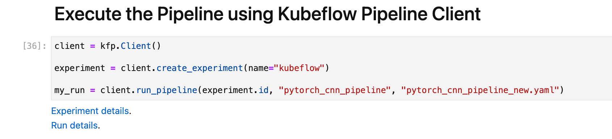 </center><br/><br/>


You will see the pipeline run executed . 

<center>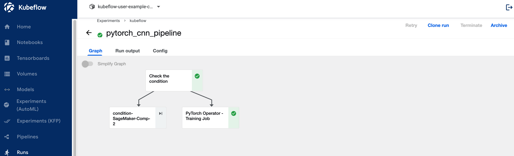 </center><br/><br/>

## 7. Cleanup

7.1. Remove Kubeflow from your EKS cluster

To uninstall Kubeflow from your cluster, from your `aws-do-kubeflow` container, execute:

```bash
./kubeflow-remove.sh
```

7.2. Remove EKS cluster (Optional)

If you provisioned your EKS cluster specifically for this workshop using the [aws-do-eks](https://bit.ly/do-eks) project and would like to remove it, from your `aws-do-eks` container shell, execute:

```
./eks-delete.sh
```

Clean up of all resources is complete when the related stacks in Cloud Formation have been deleted. You may delete the cluster-related stacks from the Cloud Formation console manually as an alternative to executing the `./eks-delete.sh` script.

7.3. Remove Management Instance (Optional)

If you used the CloudFormation template in the beginning of the workshop to create your EKS cluster and wish to remove the management instance, you may do so by deleting the ManagementInstance CloudFormation stack or executing the following command:

```bash
aws cloudformation delete-stack --stack-name ManagementInstance
```

<br/><br/>


# Troubleshooting

This section contains common challenges that were experienced by users of this workshop and their respective solutions.


| ID  | Challenge | Reason | Solution |
| --- | ---       | ---    | ---      |
| 1 | `./kubeflow-deploy.sh` script fails | `aws-do-kubeflow` container is not connected to the EKS cluster | 1. Execute `kubectl get nodes` within the container to verify connectivity<br/>2. Execute `kubectx` within the container to list configured clusters<br/>3. Ensure `~/.kube/config` contins your desired cluster configuration. If not, you may leverage the [./eks-connect.sh](https://github.com/aws-samples/aws-do-eks/blob/main/Container-Root/eks/eks-connect.sh) script from the [aws-do-eks](https://bit.ly/do-eks) project<br/>4. Ensure the name of the connected EKS cluster matches the [AWS_CLUSTER_NAME](https://github.com/aws-samples/aws-do-kubeflow/blob/main/.env#L19) configured in your [aws-do-kubeflow](https://bit.ly/aws-do-kubeflow) project |
| 2 | Kubeflow dashboard fails to open through Cloud9. `Ooops...` is displayed instead of the dashboard<br/>or<br/>Kubeflow dashboard is open, but `[403] Could not find CSRF cookie XSRF-TOKEN in the request` error is displayed in the browser's status bar | Cloud9 VFS session connection failure | List of independent possible solutions:<br/>1. Re-login to your AWS account and reopen Cloud9, the retry opening the Kubeflow dashboard<br/>2. Open Cloud9 in a different browser and retry openeing the Kubeflow dashboard<br/>3. Configure access to your EKS cluster on your local machine instead of from Cloud9 and then execute the `./kubeflow-expose.sh` script locally. Visit http://localhost:8080 to access the Kubeflow dashboard<br/>4. Expose the Istio Ingress Gateway service through a classic load balancer by executing `kubectl -n istio-system edit service istio-ingressgateway` and replacing `NodePort` with `LoadBalancer`. The command `kubectl -n istio-system get svc` will show the external address of the load balancer. Copy the address and visit `http://<your_external_lb_address>` in your browser. Once the Kubeflow dashboard comes up, to secure your Kubeflow connection, edit the security group associated with your load balancer to allow HTTP traffic only from your own external IP address<br/>5. Work with your IT department to expose your Kubeflow instance behind an Application Load Balancer with a domain name and SSL certificate |
| 3 | `efs-sc` is not available as an option in the storage class dropdown in the volumes section of the Kubeflow dashboard | EFS CSI driver is not deployed or efs-sc storage class is not created | 1. Diagnose the issue: execute `kubectl get pods -A \| grep efs` to check if the EFS CSI pods are present and in Running state, also execute `kubectl get sc` to find out if the `efs-sc` storage class is available. If either is missing, go to step 2, otherwise try step 3<br/>2. Deploy the EFS CSI driver by using the [deploy.sh](https://github.com/aws-samples/aws-do-eks/blob/main/Container-Root/eks/deployment/csi/efs/deploy.sh) script in the [aws-do-eks](https://bit.ly/do-eks) project<br/>3. In case the storage class is still not available, restart Kubeflow by executing [./kubeflow-restart.sh](https://github.com/aws-samples/aws-do-kubeflow/blob/main/Container-Root/kubeflow/kubeflow-restart.sh) from within your `aws-do-kubeflow` container |
| 4 | SageMaker pipeline execution fails with error in `connection.py` | Missing VPC endpoint or permissions | Refer to the VPC Endpoint creation line in [the Cloud Formation script](https://github.com/aws-samples/aws-do-eks/blob/main/wd/cfn/ManagementInstance.json#L60") which is used to create a standard environment for this workshop. Execute the `vpc/vpc-endpoint-create.sh` script from the [aws-do-eks](https://bit.ly/aws-do-eks") project. Also execute the `iam/node-role-expand.sh` and `iam/sm-role-create.sh` scripts if that has not been done when your workshop environment was set up | 
| 5 | SageMaker pipeline execution fails on P3 EC2 instances | P3 EC2 instances are disallowed by default | 1. In the **Create hybrid Kubeflow Pipeleine** section of Jupyter notebook [2_create_pipeline_k8s_sagemaker.ipynb](https://github.com/aws-samples/aws-do-kubeflow/blob/main/Container-Root/kubeflow/examples/distributed-training/pytorch/workshop/2_create_pipeline_k8s_sagemaker.ipynb), replace `instance_type='ml.p3.2xlarge'` with `instance_type='ml.c5.2xlarge'` or another CPU EC2 instance type of your choice<br/>or<br/>2. From your AWS Console, request an increase of your P3 quota for SageMaker following the information [here](https://docs.aws.amazon.com/sagemaker/latest/dg/regions-quotas.html#:~:text=General%20Reference.-,Quotas,-For%20a%20list). Additionally, you may contact your AWS Technical Account Manager (TAM) or AWS Support team regarding your request |
| 6 | CloudFormation template fails to create eks-kubeflow cluster | Account specific root cause | There are several reasons why creation of the new EKS cluster could fail. Examples include: cluster already exists, maximum number of VPCs reached, maximum number of ElasticIPs reached, etc. <br/> 1. Identify the reason by reviewing the `/tmp/bootstrap.log` file on the ManagementInstance and the stack events in CloudFormation <br/> 2. Correct the specific root cause in your account <br/> 3. Either delete the CloudFormation stacks and create a new stack using the [CloudFormation template](https://raw.githubusercontent.com/aws-samples/aws-do-eks/main/wd/cfn/dtw-kubeflow/ManagementInstance.json) <br/>or<br/> Clean up only as needed and execute the line of the userdata script that failed. The userdata script can be retrieved by executing the following command on the Management Instance: `curl http://169.254.169.254/latest/user-data` |
