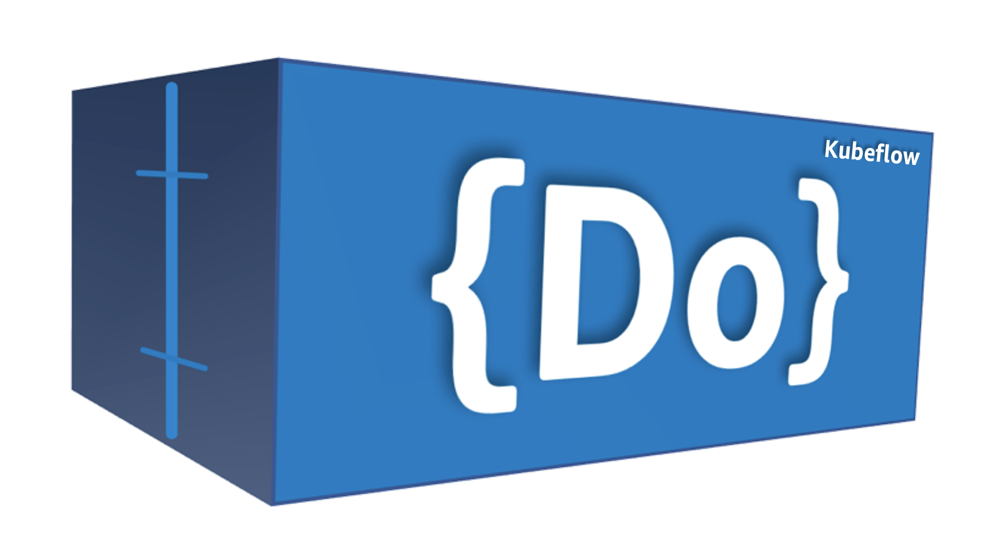
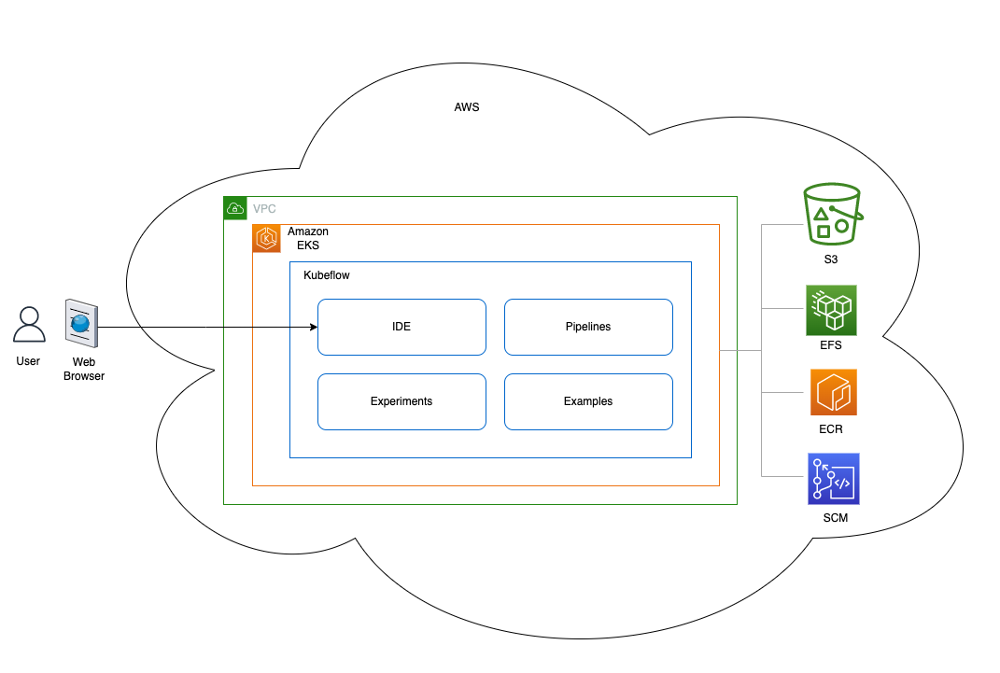
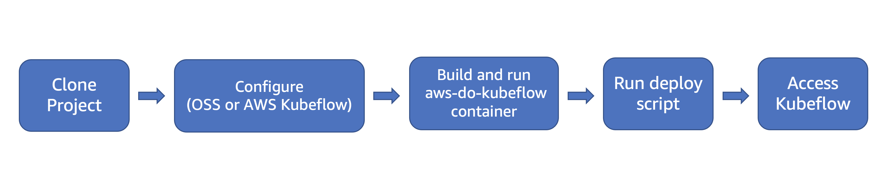
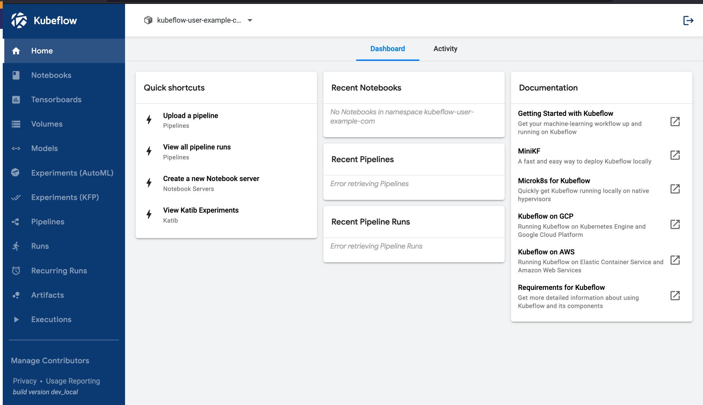

# AWS Do Kubeflow - Deploy and Manage Kubeflow on AWS EKS

## Overview

[Kubeflow](https://www.kubeflow.org) is an open source project which deploys on Kubernetes. It provides end-to-end ML platform and workflow capabilities. There are a number of ways to deploy Kubeflow as well as many variations of Kubeflow that can be deployed. The goal of `aws-do-kubeflow` is to simplify the deployment and management of Kubeflow on AWS as well as provide some useful ML examples. This project follows the principles of the [Do Framework](https://bit.ly/do-framework) and the structure of the [Depend on Docker](https://bit.ly/do-docker-project) template. It containerizes all the tools necessary to deploy and manage Kubeflow using [Docker](https://docs.docker.com/get-docker/), then executes the deployment from within the container. All you need is an AWS Account. 

Below is an overview diagram that shows the general architecture of a Kubeflow deployment on EKS.

  

Fig.1 - Deployment Architecture
  

The deployment process is described on Fig. 2 below:

  

Fig.2 - Kubeflow deployment process with aws-do-kubeflow
  

## Prerequisites
1) AWS Account - you will need an AWS account
2) EKS Cluster - it is assumed that an EKS cluster already exists in the account. If a cluster is needed, one way to create it, is by following the instructions in the [aws-do-eks](https://github.com/aws-samples/aws-do-eks) project. In that case it is recommended to use cluser manifest `/eks/eks-kubeflow.yaml`, located within the aws-do-eks conatiner.
3) Optionally, we recommend using [AWS Cloud9](https://aws.amazon.com/cloud9/) as a working environment. Instructions for setting up a Cloud9 IDE are available [here](https://github.com/aws-samples/aws-distributed-training-workshop-eks/blob/main/SETUP.md#04-setup-cloud9-ide)

## Configure 
All configuration settings of the `aws-do-kubeflow` project are centralized in its [`.env`](.env) file. To review or change any of the settings, simply execute [`./config.sh`](./config.sh). The AWS_CLUSTER_NAME setting must match the name of your existing EKS Cluster, and AWS_REGION should match the AWS Region where the cluster is deployed.

The `aws-do-kubeflow` project supports both the generic and AWS specific Kubeflow distributions. Your desired distribution to deploy, can be configured via setting `KF_DISTRO`. By default, the project deploys the AWS vanilla distribution.

## Build
Please execute the [`./build.sh`](./build.sh) script to build the project. This will create the "aws-do-kubeflow" container image and tag it using the registry and version tag specified in the project configuration.

## Run
Execute [`./run.sh`](./run.sh) to bring up the Docker container. 

## Status
To check if the container is up, execute [`./status.sh`](./status.sh). If the container is in Exited state, it can be started with [`./start.sh`](./start.sh`) 

## Exec
Executing the [`./exec.sh`](./exec.sh) script will open a bash shell inside the `aws-do-kubeflow` container.

## Deploy Kubeflow
To deploy your configured distribution of Kubeflow, simply execute ['./kubeflow-deploy.sh](Container-Root/kubeflow/kubeflow-deploy.sh)

The deployment creates several groups of pods in your EKS cluster. Upon successful deployment, all pods will be in Running state. To check the state of all pods in the cluster, use command:
`kubectl get pods -A`.

## Access Kubeflow Dashboard
In order to access the Kubeflow Dashboard, the Istio Ingress Gateway service of this Kubeflow deployment needs to be exposed outside the cluster. In a production deployment this is typically done via an Application Load Balancer (ALB), however this requires a DNS domain registration and a matching SSL certificate. 

For an easy way to expose the Kubeflow Dashboard, we can use `kubectl port-forward` from Cloud9 or from any machine that has a browser and kubectl access to the cluster.
To start the port-forward, execute script [`./kubeflow-expose.sh`](Container-Root/kubeflow/kubeflow-expose.sh). 

If you are in Cloud9, select Preview->Preview Running Application. This will open a browser tab within Cloud9. You can expand that tab to a full-browser by clicking the icon in the upper-right corner.

If you are on a machine with its own browser, just navigate to localhost:8080 to open the Kubeflow Dashboard.

  

Fig. 3 - Kubeflow Dashboard
  

## Remove Kubeflow Deployment
To remove your Kubeflow deployment, simply execute [`./kubeflow-remove.sh`](Container-Root/kubeflow/kubeflow-remove.sh) from within the `aws-do-kubeflow` container.

## Command reference

* [./config.sh](./config.sh) - configure aws-do-kubeflow project settings interactively
* [./build.sh](./build.sh) - build aws-do-kubeflow container image
* [./login.sh](./login.sh) - login to the configred container registry
* [./push.sh](./push.sh) - push aws-do-kubeflow container image to configured registry
* [./pull.sh](./pull.sh) - pull aws-do-kubeflow container image from a configured existing registry
* [./prune.sh](./prune.sh) - delete all unused docker containers, networks and images from the local host
* [./run.sh](./run.sh) - run aws-do-kubeflow container
* [./status.sh](./status.sh) - show current aws-do-kubeflow container status
* [./logs.sh](./logs.sh) - show logs of the running aws-do-kubeflow container
* [./start.sh](./start.sh) - start the aws-do-kubeflow container if is currently in "Exited" status
* [./exec.sh](./exec.sh) - execute a command inside the running aws-do-kubeflow container, the default command is `bash`
* [./stop.sh](./stop.sh) - stop and remove the aws-do-kubeflow container
* [./test.sh](./test.sh) - run container unit tests

## Security

See [CONTRIBUTING](CONTRIBUTING.md#security-issue-notifications) for more information.

## License

This library is licensed under the MIT-0 License. See the [LICENSE](LICENSE) file.

## Troubleshooting

* Cloud9 instance running out of disk space - refer to instructions for increasing of volume size [here](https://github.com/aws-samples/aws-distributed-training-workshop-eks/blob/main/SETUP.md#04-setup-cloud9-ide)

* Errors regarding your permissions as a user in Cloud9 - refer to [Create an IAM role for your Workspace](https://www.eksworkshop.com/020_prerequisites/iamrole/).

* Namespaces are left in Terminating state when removing a Kubeflow deployment - execute script [`./configure/ns-clear.sh`](Container-Root/kubeflow/configure/ns-clear.sh)

## Credits
* Mark Vinciguerra - @mvincig
* Jason Dang - @jndang
* Tatsuo Azeyanagi - @tazeyana
* Alex Iankoulski - @iankouls
* Kanwaljit Khurmi - @kkhurmi
* Milena Boytchef - @boytchef
* Gautam Kumar - @gauta

## References
* [Machine Learning Using Kubeflow](https://www.eksworkshop.com/advanced/420_kubeflow/)
* [Docker](https://www.docker.com)
* [Kubernetes](https://kubernetes.io)
* [Kubeflow](https://www.kubeflow.org/)
* [Amazon Web Services](https://aws.amazon.com)
* [Depend On Docker Project](https://github.com/iankoulski/depend-on-docker)
* [AWS Do EKS Project](https://github.com/aws-samples/aws-do-eks)
* [Kubeflow on AWS](https://awslabs.github.io/kubeflow-manifests/)
* [AWS Kubeflow Deployment](https://awslabs.github.io/kubeflow-manifests/docs/deployment/vanilla/guide/)
* [AWS Kubeflow Blog](https://aws.amazon.com/blogs/machine-learning/build-and-deploy-a-scalable-machine-learning-system-on-kubernetes-with-kubeflow-on-aws/)
* [AWS Kubeflow Multitenancy](https://aws.amazon.com/blogs/opensource/building-a-multi-tenant-kubeflow-environment-on-amazon-eks-using-amazon-cognito-and-adfs/)
* [Kubeflow Pipelines](https://github.com/kubeflow/pipelines)
* [Kubeflow Training Operator](https://github.com/kubeflow/training-operator/tree/master/sdk/python/kubeflow/training/models)
* [EKS Distributed Training Workshop](https://github.com/aws-samples/aws-distributed-training-workshop-eks)
* [Kubeflow MPI Operator](https://github.com/kubeflow/mpi-operator)
* [Distributed Training with Tensorflow and Kubeflow](https://github.com/aws-samples/amazon-eks-machine-learning-with-terraform-and-kubeflow)
* [Distributed Training using Pytorch with Kubeflow](Container-Root/kubeflow/examples/distributed-training/pytorch/workshop/README.md)

