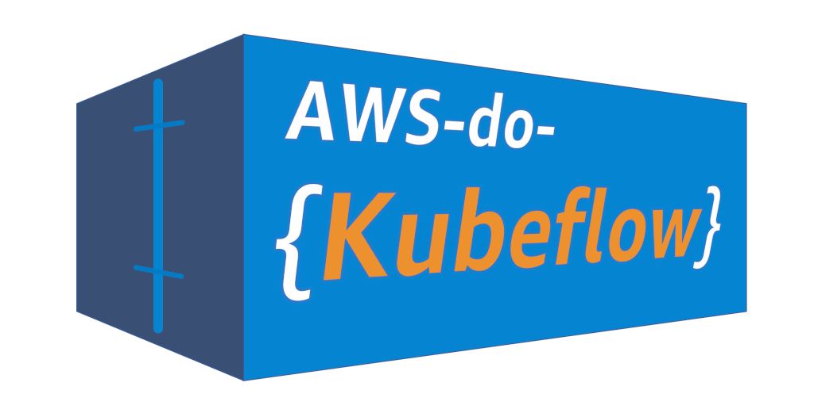

# AWS do Kubeflow (aws-do-kubeflow) <br/> Deploy and Manage Kubeflow on AWS using the [do-framework](https://bit.ly/do-framework)

## Overview

[Kubeflow](https://www.kubeflow.org) is an open source project which deploys on Kubernetes. It provides end-to-end ML platform and workflow capabilities. There are a number of ways to deploy Kubeflow as well as many variations of Kubeflow that can be deployed. The goal of `aws-do-kubeflow` is to simplify the deployment and management of Kubeflow on AWS as well as provide some useful ML examples. This project follows the principles of the [Do Framework](https://bit.ly/do-framework) and the structure of the [Depend on Docker](https://bit.ly/do-docker-project) template. It containerizes all the tools necessary to deploy and manage Kubeflow using [Docker](https://docs.docker.com/get-docker/), then executes the deployment from within the container. All you need is an AWS Account. 

For a hands-on experience with Kubeflow and its application for distributed ML training workflows, please see our online [workshop](Container-Root/kubeflow/examples/distributed-training/pytorch/workshop/README.md) and walk through the self-paced [workshop steps](Container-Root/kubeflow/examples/distributed-training/pytorch/workshop/WORKSHOP_STEPS.md). 

Below is an overview diagram that shows the general architecture of a Kubeflow deployment on Amazon EKS.

<center></center> <br/>
<center>Fig.1 - Deployment Architecture</center> <br/>

The deployment process is described on Fig. 2 below:

<center></center> <br/>
<center>Fig.2 - Kubeflow deployment process with aws-do-kubeflow</center> <br/>

## Prerequisites
1) AWS Account - you will need an AWS account
2) EKS Cluster - it is assumed that an EKS cluster already exists in the account. If a cluster is needed, one way to create it, is by following the instructions in the [aws-do-eks](https://github.com/aws-samples/aws-do-eks) project. In that case it is recommended to use cluser manifest `/eks/eks-kubeflow.yaml`, located within the aws-do-eks conatiner.
3) Optionally, you can create an [Amazon SageMaker HyperPod](https://aws.amazon.com/sagemaker-ai/hyperpod/) cluster and deploy Kubeflow there. If a HyperPod cluster is needed, one way to create it, is by following the instructions in the [aws-do-hyperpod](https://github.com/aws-samples/aws-do-hyperpod) project.
4) Default StorageClass - it is assumed that a default StorageClass already exists in the underlying EKS cluster when deploying Kubeflow. Some of the Kubeflow components require storage volumes to be available and will create these using a default StorageClass. Please ensure a default StorageClass is set up before deploying Kubeflow. If you need to create one, you can follow the instructions below in the section "Create default StorageClass".

## Create Default StorageClass
In order for all the components of Kubeflow to work properly, some require a persistent volume which they will attach to the corresponding pod. These components will create the volumes automatically during the deployment of Kubeflow. However, in order for them to create these volumes, they require a default StorageClass to be set up in your EKS cluster. Below we show how to set up a default StorageClass for [FSx for Lustre](https://aws.amazon.com/fsx/lustre/). Note that you can use other storage options (e.g. [EFS](https://aws.amazon.com/efs/)) and do not have to use FSx for Lustre. 

In order to deploy a Default StorageClass, you can either use our automatic deployment scripts or set up all the necessary resources yourself. For both options we provide a detailed step-by-step guide below.

<details>
<summary>Manual deployment</summary>

### Install the Amazon FSx for Lustre CSI Driver

The Amazon FSx for Lustre Container Storage Interface (CSI) driver uses IAM roles for service accounts (IRSA) to authenticate AWS API calls. To use IRSA, an IAM OpenID Connect (OIDC) provider needs to be associated with the OIDC issuer URL that comes provisioned your EKS cluster.

Create an IAM OIDC identity provider for your cluster with the following command:

```bash
eksctl utils associate-iam-oidc-provider --cluster $AWS_CLUSTER_NAME --approve
```

Deploy the FSx for Lustre CSI driver:
```bash
helm repo add aws-fsx-csi-driver https://kubernetes-sigs.github.io/aws-fsx-csi-driver

helm repo update

helm upgrade --install aws-fsx-csi-driver aws-fsx-csi-driver/aws-fsx-csi-driver\
  --namespace kube-system 
```

> [!NOTE]  
> This Helm chart includes a service account named `fsx-csi-controller-sa` that gets deployed in the `kube-system` namespace.

Use the eksctl CLI to create an IAM role bound to the service account used by the driver, attaching the AmazonFSxFullAccess AWS-managed policy:
```bash
eksctl create iamserviceaccount \
  --name fsx-csi-controller-sa \
  --override-existing-serviceaccounts \
  --namespace kube-system \
  --cluster $AWS_CLUSTER_NAME \
  --attach-policy-arn arn:aws:iam::aws:policy/AmazonFSxFullAccess \
  --approve \
  --role-name AmazonEKSFSxLustreCSIDriverFullAccess \
  --region $AWS_REGION
```

> [!NOTE]  
> The `--override-existing-serviceaccounts` flag lets eksctl know that the `fsx-csi-controller-sa` service account already exists on the EKS cluster, so it skips creating a new one and updates the metadata of the current service account instead.

Annotate the driver's service account with the ARN of the `AmazonEKSFSxLustreCSIDriverFullAccess` IAM role that was created:
```bash
SA_ROLE_ARN=$(aws iam get-role --role-name AmazonEKSFSxLustreCSIDriverFullAccess --query 'Role.Arn' --output text)

kubectl annotate serviceaccount -n kube-system fsx-csi-controller-sa \
  eks.amazonaws.com/role-arn=${SA_ROLE_ARN} --overwrite=true
```

This annotation lets the driver know what IAM role it should use to interact with the FSx for Lustre service on your behalf.

Restart the fsx-csi-controller deployment for the changes to take effect:
```bash
kubectl rollout restart deployment fsx-csi-controller -n kube-system
```

### Create default StorageClass

Create the StorageClass for FSx for Lustre and ensure that it is annotated as default.

```bash
cat <<EOF> storageclass.yaml
kind: StorageClass
apiVersion: storage.k8s.io/v1
metadata:
  name: fsx-sc
  annotations:
    storageclass.kubernetes.io/is-default-class: "true"
provisioner: fsx.csi.aws.com
parameters:
  subnetId: $SUBNET_ID
  securityGroupIds: $SECURITYGROUP_ID
  deploymentType: PERSISTENT_2
  automaticBackupRetentionDays: "0"
  copyTagsToBackups: "true"
  perUnitStorageThroughput: "250"
  dataCompressionType: "LZ4"
  fileSystemTypeVersion: "2.15"
mountOptions:
  - flock
EOF
```

Now, deploy this StorageClass to take effect:

```bash
kubectl apply -f storageclass.yaml
```

</details>

<details>
<summary>Automatic deployment</summary>

1. Navigate into the `deployments/fsx/` directory by using `cd /kubeflow/deployments/fsx`
2. Execute the `deploy-requirements.sh` script 
3. Execute the `create-storageclass.sh` script 

>[!NOTE]
> If you would like to use a different kind of storage for your default StorageClass, simply install the necessary CSI drivers and edit the `storageclass.yaml` accordingly

</details>

## Configure 
All configuration settings of the `aws-do-kubeflow` project are centralized in its [`.env`](.env) file. To review or change any of the settings, simply execute [`./config.sh`](./config.sh). The AWS_CLUSTER_NAME setting must match the name of your existing EKS Cluster, and AWS_REGION should match the AWS Region where the cluster is deployed.

The `aws-do-kubeflow` project supports both the generic and AWS specific Kubeflow distributions. Your desired distribution to deploy, can be configured via setting `KF_DISTRO`. By default, the project deploys the AWS vanilla distribution.

> [!IMPORTANT]  
> Please note that the AWS specific Kubeflow distribution is no longer actively maintained. 

## Build
Please execute the [`./build.sh`](./build.sh) script to build the project. This will create the "aws-do-kubeflow" container image and tag it using the registry and version tag specified in the project configuration.

## Run
Execute [`./run.sh`](./run.sh) to bring up the Docker container. 

## Status
To check if the container is up, execute [`./status.sh`](./status.sh). If the container is in Exited state, it can be started with [`./start.sh`](./start.sh`) 

## Exec
Executing the [`./exec.sh`](./exec.sh) script will open a bash shell inside the `aws-do-kubeflow` container.

## Deploy Kubeflow
To deploy your configured distribution of Kubeflow, simply execute [`./kubeflow-deploy.sh`](Container-Root/kubeflow/kubeflow-deploy.sh)

The deployment creates several groups of pods in your EKS cluster. Upon successful deployment, all pods will be in Running state. To check the state of all pods in the cluster, use command:
`kubectl get pods -A`.

> [!NOTE]  
> Please note that the complete deployment takes up to 30 minutes until all resources and pods are in `running` state.

## Access Kubeflow Dashboard
In order to access the Kubeflow Dashboard, the Istio Ingress Gateway service of this Kubeflow deployment needs to be exposed outside the cluster. In a production deployment this is typically done via an Application Load Balancer (ALB), however this requires a DNS domain registration and a matching SSL certificate. 

For an easy way to expose the Kubeflow Dashboard, we can use `kubectl port-forward` from from any machine that has a browser and kubectl access to the cluster.
To start the port-forward, execute script [`./kubeflow-expose.sh`](Container-Root/kubeflow/kubeflow-expose.sh). 

If you are on a machine with its own browser, just navigate to localhost:8080 to open the Kubeflow Dashboard.

> [!NOTE]  
> Kubeflow uses a default email (`user@example.com`) and password (`12341234`). For any production Kubeflow deployment, you should change the default password by following the official [Kubeflow documentation](https://github.com/kubeflow/manifests?tab=readme-ov-file#change-default-user-password).

> [!NOTE]  
> Please change the mount path for Notebook Volumes when creating a new notebook to avoid `permission denied` errors. You can use e.g. `/volume/` 


<center></center> <br/>
<center>Fig. 3 - Kubeflow Dashboard</center> <br/>


## Remove Kubeflow Deployment
To remove your Kubeflow deployment, simply execute [`./kubeflow-remove.sh`](Container-Root/kubeflow/kubeflow-remove.sh) from within the `aws-do-kubeflow` container.

## Command reference

* [./config.sh](./config.sh) - configure aws-do-kubeflow project settings interactively
* [./build.sh](./build.sh) - build aws-do-kubeflow container image
* [./login.sh](./login.sh) - login to the configred container registry
* [./push.sh](./push.sh) - push aws-do-kubeflow container image to configured registry
* [./pull.sh](./pull.sh) - pull aws-do-kubeflow container image from a configured existing registry
* [./prune.sh](./prune.sh) - delete all unused docker containers, networks and images from the local host
* [./run.sh](./run.sh) - run aws-do-kubeflow container
* [./status.sh](./status.sh) - show current aws-do-kubeflow container status
* [./logs.sh](./logs.sh) - show logs of the running aws-do-kubeflow container
* [./start.sh](./start.sh) - start the aws-do-kubeflow container if is currently in "Exited" status
* [./exec.sh](./exec.sh) - execute a command inside the running aws-do-kubeflow container, the default command is `bash`
* [./stop.sh](./stop.sh) - stop and remove the aws-do-kubeflow container
* [./test.sh](./test.sh) - run container unit tests

## Security

See [CONTRIBUTING](CONTRIBUTING.md#security-issue-notifications) for more information.

## License

This library is licensed under the MIT-0 License. See the [LICENSE](LICENSE) file.

## Troubleshooting

* Namespaces are left in Terminating state when removing a Kubeflow deployment - execute script [`./configure/ns-clear.sh`](Container-Root/kubeflow/configure/ns-clear.sh)

## Credits
* Mark Vinciguerra - @mvincig
* Jason Dang - @jndang
* Florian Stahl - @flostahl
* Tatsuo Azeyanagi - @tazeyana
* Alex Iankoulski - @iankouls
* Kanwaljit Khurmi - @kkhurmi
* Milena Boytchef - @boytchef
* Gautam Kumar - @gauta


## References
* [Machine Learning Using Kubeflow](https://www.eksworkshop.com/advanced/420_kubeflow/)
* [Docker](https://www.docker.com)
* [Kubernetes](https://kubernetes.io)
* [Kubeflow](https://www.kubeflow.org/)
* [Amazon Web Services](https://aws.amazon.com)
* [Depend On Docker Project](https://github.com/iankoulski/depend-on-docker)
* [AWS Do EKS Project](https://github.com/aws-samples/aws-do-eks)
* [Amazon SageMaker HyperPod](https://aws.amazon.com/sagemaker-ai/hyperpod/)
* [AWS Do HyperPod Project](https://github.com/aws-samples/aws-do-hyperpod/)
* [Kubeflow on AWS](https://awslabs.github.io/kubeflow-manifests/)
* [AWS Kubeflow Deployment](https://awslabs.github.io/kubeflow-manifests/docs/deployment/vanilla/guide/)
* [AWS Kubeflow Blog](https://aws.amazon.com/blogs/machine-learning/build-and-deploy-a-scalable-machine-learning-system-on-kubernetes-with-kubeflow-on-aws/)
* [AWS Kubeflow Multitenancy](https://aws.amazon.com/blogs/opensource/building-a-multi-tenant-kubeflow-environment-on-amazon-eks-using-amazon-cognito-and-adfs/)
* [Kubeflow Pipelines](https://github.com/kubeflow/pipelines)
* [Kubeflow Training Operator](https://github.com/kubeflow/training-operator/tree/master/sdk/python/kubeflow/training/models)
* [EKS Distributed Training Workshop](https://github.com/aws-samples/aws-distributed-training-workshop-eks)
* [Kubeflow MPI Operator](https://github.com/kubeflow/mpi-operator)
* [Distributed Training with Tensorflow and Kubeflow](https://github.com/aws-samples/amazon-eks-machine-learning-with-terraform-and-kubeflow)
* [Distributed Training using Pytorch with Kubeflow](Container-Root/kubeflow/examples/distributed-training/pytorch/workshop/README.md)
* [Build Flexible and Sacalable Distributed Training Architectures using Kubeflow on AWS and Amazon SageMaeker](https://aws.amazon.com/blogs/machine-learning/build-flexible-and-scalable-distributed-training-architectures-using-kubeflow-on-aws-and-amazon-sagemaker/)
